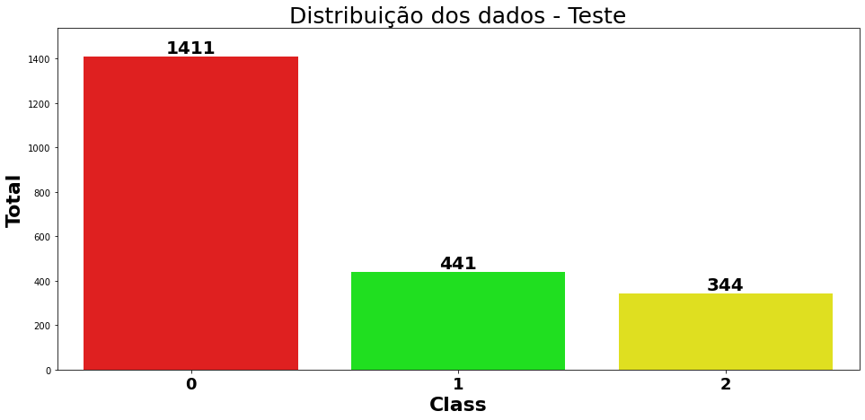
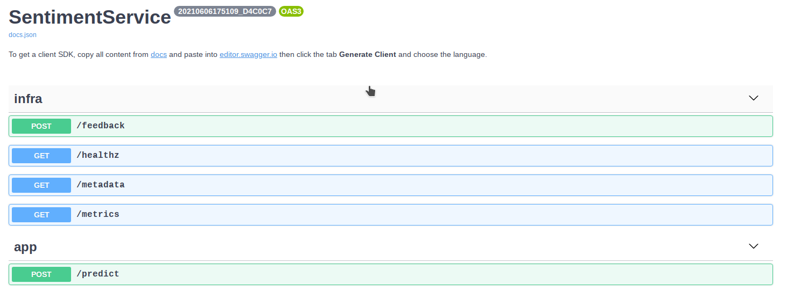

# <span style="color:blue">PROJETO: Análise de Sentimentos - Pull Requests</span>

<b>O problema</b>: Um problema comum em NLP é a classificação de amostras de texto, isto é, dado um texto, alocar em uma categoria, ou medir um índice de afinidade para uma ou mais categorias. Um problema comum em grandes projetos de código aberto é determinar quando o comentário em um pull request é positivo ou negativo.

<b>O objetivo</b>: Construir um modelo para classificação de comentários de pull-requests, indicando se podem ser consideradas <b>positivas</b>, <b>negativas</b> ou <b>neutras</b>.

------------------------------------------------------------------

### Organização do projeto
Existem duas pastas com os sub-projetos deste desafio:

* trainer: Possui o código para o treinamento do modelo
* API: Possui o código para expor o modelo como API

Em cada um desses sub-projetos existe um arquivo <b>README.md</b> com instruções específicas de cada um.

------------------------------------------------------------------

### Premissas do projeto
Para este desafio foram estabelecidas algumas premissas:

* Foi utilizado um modelo pré-treinado para análise de sentimentos (https://huggingface.co/cardiffnlp/twitter-roberta-base-sentiment). Esse modelo foi treinado em um grande conjunto de dados de Twitter para análise de sentimentos, e o conhecimento adquirido pode ser transferido para o problema proposto;
* A decisão de utilizar um modelo pré-treinado é porque os modelos de linguagem atualmente são considerados estado da arte para esse tipo de tarefa (http://nlpprogress.com/english/sentiment_analysis.html). Contudo, isso tem um maior custo computacional, pois são modelos maiores e precisam de maior poder computacional para o treinamento e também para inferência. Outras opções poderiam ter sido avaliadas, contudo essa opção para o teste pareceu viável pois atinge o estado da arte nesse tipo de problema em vários conjuntos de dados e além disso é um modelo que uso na minha pesquisa de mestrado;
* O problema proposto são para dados de pull requests, contudo o modelo base utilizado foram de dados do Twitter, ou seja, será realizada uma tranferência de aprendizado de domínios diferentes (cross-domain). Em um cenário real, poderia ser avalidado de se fazer anotações no próprio domínio do problema, contudo para um teste é esperado que essa abordagem funcione bem;
* Foi utilizado um dataset público (https://www.kaggle.com/crowdflower/twitter-airline-sentiment) com três classes, para o treinamento do modelo supervisionado, pois o modelo indicado só possuia duas classes. Uma vez que o modelo foi treinado para ter duas saídas não é possível utilizá-lo para três, conforme solicitado no problema, por isso foi utilizado esse outro dataset;
* O dataset de comentários não foi utilizado, pois no meu entendimento pela descrição do problema uma possibilidade é que esse dataset fosse utilizado para o treinamento de vetores de representações (Embeddings), contudo se o intuíto de fato for esse, um treinamento de abordagens como Word2Vec poderia não ser tão efetiva por ser vetores estáticos, ou seja, a representações são sempre fixas independente do contexto. Por isso, a decisão foi usar um modelo de linguagem, pois as representações vetoriais são contextuais. É importante deixar claro que em um cenário real, as duas opções e outras poderiam ser avaliadas para decidir qual abordagem seria mais adequada para resolver o problema, contudo para conclusão do teste foi escolhida essa abordagem por inicialmente parecer mais adequada;
* Para a construção da API foi utilizado o framework [BentoML](https://docs.bentoml.org/en/latest/index.html), pois possui recursos de escalabilidade horizontal podendo ser realizado o deploy por exemplo em Kubernetes. Além disso, o framework suporta múltiplos frameworks de machine learning, incluindo Tensorflow, PyTorch, Keras, XGBoost e outros. Outro recurso interessante é que possui deployment nativo para vários Cloud Providers, como AWS, Azure e outros. Outro destaque é a implementação da técnica de Micro batching em que as solicitações de previsão de entrada são agrupadas em pequenos lotes para obter a vantagem de desempenho do processamento em lote em tarefas de inferência de modelo. A API gerada já gera endpoints para monitoramento com o [Prometheus](https://prometheus.io/) e também gera a documentação com o [Swagger](https://swagger.io/).
------------------------------------------------------------------

### Análise dos dados
Pode ser observado que existe um desbalanceamento dos dados na classe negative, isso pode gerar um viés para o modelo. Poderia ser aplicada alguma técnica de downsampling ou oversampling para balancear o dataset, contudo nesse caso em específico não será aplicada nenhuma técnica pois o objetivo aqui é mostrar o processo do treinamento e "produtização" de um modelo de machine learning.


## Preparação dos dados
Para o treinamento do modelo serão realizadas algumas etapas descritas abaixo:

* Codificar os labels que estão como texto para números usando a regra: 0 - negative, 1 - neutral e 2 - positive;
* Remover as colunas que não serão usadas no treinamento do modelo;
* Separar o conjunto de dados em treino, validação e teste.
------------------------------------------------------------------

## Split dos dados

O dataset foi separado em train (treino), val (validação) e test (teste) respeitando
a mesma distribuição de classes do dataset completo.


------------------------------------------------------------------


------------------------------------------------------------------


------------------------------------------------------------------

## Análise dos resultados
Os resultados aqui apresentados são dos dados separados para testes após o finetunnig do modelo (transfer learning).


------------------------------------------------------------------


------------------------------------------------------------------

* A acurácia do modelo foi de <b>82.42%</b>, o que já é um bom resultado para uma transferência de aprendizado e como baseline.
* A classe que tem menor assertividade é a Neutral e para melhorar isso talvez balancear o dataset seja uma saída.

------------------------------------------------------------------

## Execução dos projetos
Os projetos foram publicados com imagens Docker no DockerHub e podem ser executados conforme comandos abaixo:


### Subindo o container Docker do modelo - Imagem DockerHub
```bash
$ docker run -p 5000:5000 verissimomanoel/sapr_service_api
```

## Exemplo de chamada e retorno da API

### Request
```bash
$ curl -X POST "http://localhost:5000/predict" -H "accept: */*" -H "Content-Type: application/json" -d "[{\"message\":\"SCEDC catalogs SCSN and SCEC formats 201412311600\",\"meta\":{\"commit_id\":\"6cc89fdc099fcdd846c1243c20af811f8d118c5d\",\"comment_id\":\"2489368162\"}}]"
```

### Response
```json
[
    {
        "neutral_score": 0.84,
        "negative_score": 0.13,
        "positive_score": 0.03,
        "meta": {
            "commit_id": "6cc89fdc099fcdd846c1243c20af811f8d118c5d",
            "comment_id": "2489368162"
        }
    }
]
```
------------------------------------------------------------------

## Swagger
Exemplo da documentação do serviço com Swagger gerado pelo BentoML.


------------------------------------------------------------------

## Postman
Na pasta <b>Postman</b> tem 2 arquivos que podem ser importados para a ferramenta Postman e testes da API:
* TALENTIFY_LOCAL.postman_environment.json - Configuração do ambiente com a URL da API
* SENTIMENT_PR_COLLECTION.postman_collection.json - Collection com um exemplo de chamada da API e 3 testes de integração.